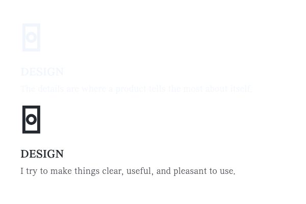
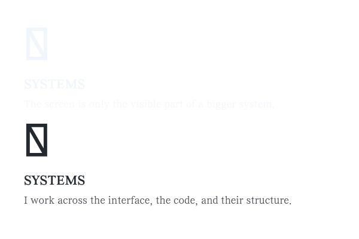
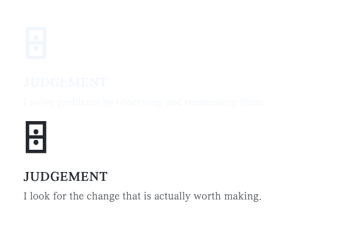
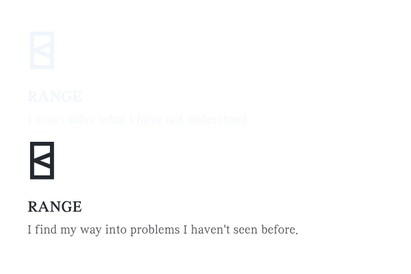
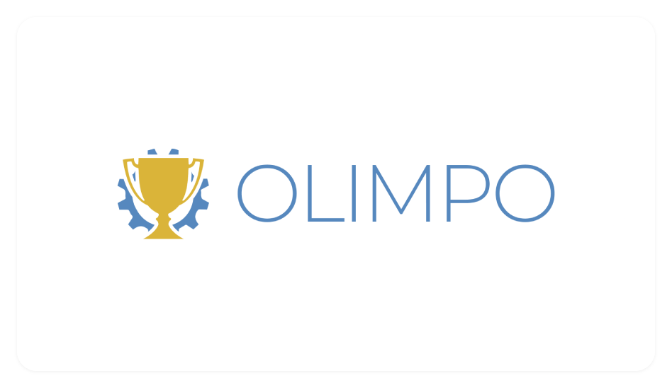
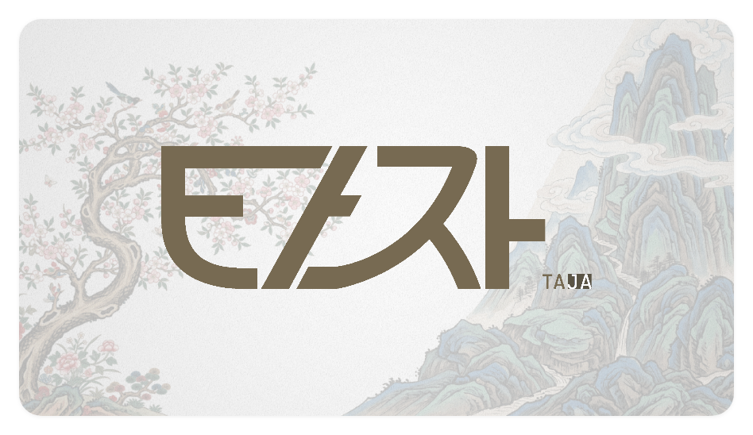
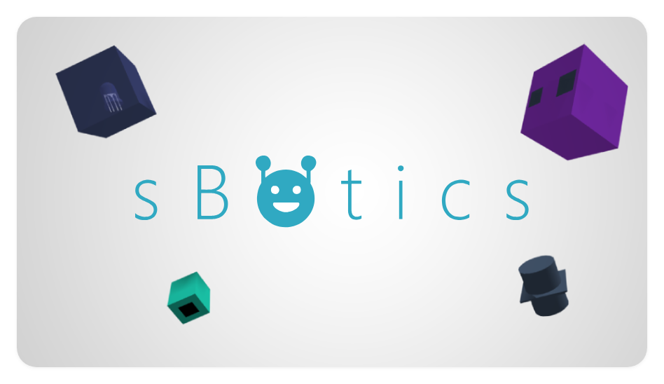
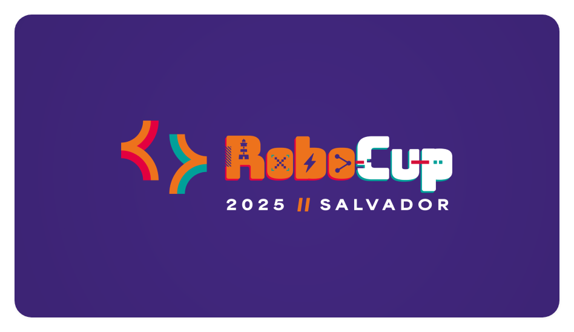
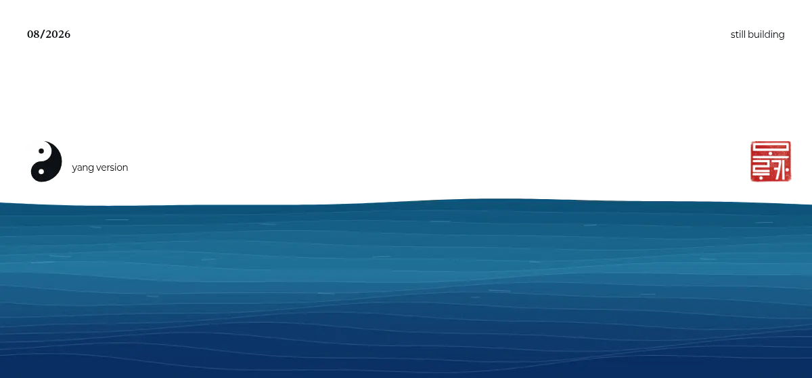

<!-- README generated with lluc.dev/labs/readme -->
<!-- each picture contains both theme texts and the viewer's GitHub theme reveals the opposite matching foreground -->

 

 

   

<a href="mailto:llucmou@gmail.com">llucmou@gmail.com</a> · <a href="https://www.linkedin.com/in/llucmou/">in/llucmou</a> · <a href="https://lluc.dev/">lluc.dev</a>
