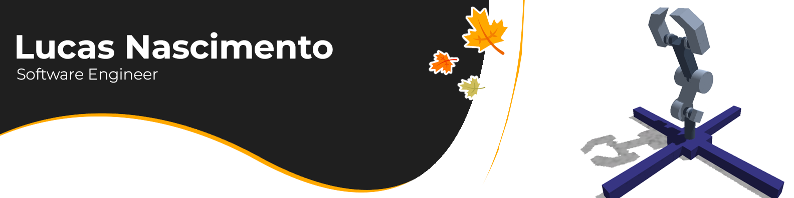
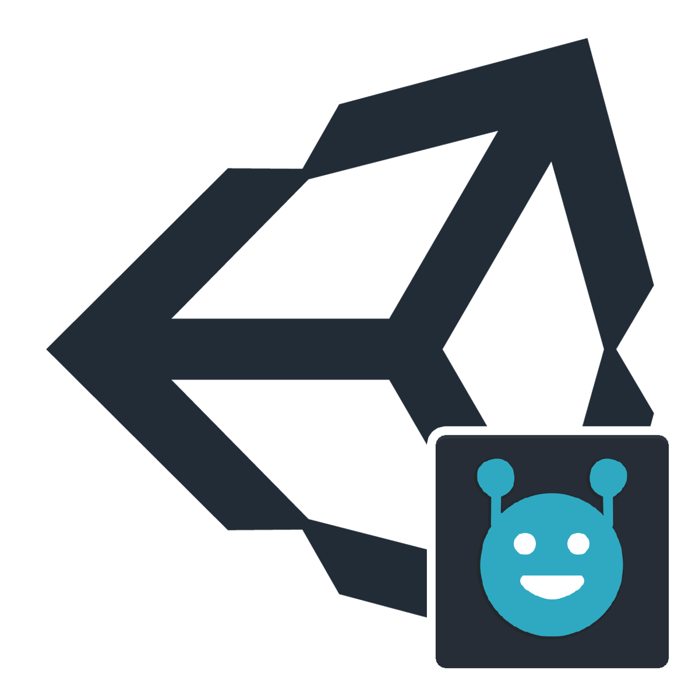

#### Unfamiliar with tech or C#? You can access my portfolio **[here](https://lluckymou.github.io)**.


## &nbsp; **Llucmou.cs**

```cs
using System;
using System.Collections.Generic;
```



```cs
class Llucmou : Person
{
    public static string Name
    {
        get => "Lucas Nascimento";
    }

    public static string Email
    {
        get => "llucmou@gmail.com";
    }

    static Dictionary<string, string[]> experiences = new Dictionary<string, string[]>()
    {
        {"FrontEnd" , new string[] {"JS", "jQuery", "Alpine.js", "CSS", "Boostrap", "Tailwind"}},
        {"BackEnd" , new string[] {"Ruby on Rails", "JS (Node.js)", "Java (Spring boot)", "Python (Django)", "Laravel"}},
        {"Tools" , new string[] {"Unity", "Linux", "Git", "Photoshop", "Astah", "Heroku"}},
    };

    public static override string[] Experience(string type) => experiences[type];
```

## Experience
### Software Engineer


Since November 2022, I've been working as a Frontend Engineer and Software Engineer for Robocup Brasil, designing, testing, implementing and maintaining their event-organizing platform "Sistema Olimpo".
```cs
    /*
     * public function start_date() {
     *   return strtotime('2022-11-01');
     * }
     *
     * public function end_date() {
     *   return Carbon::now();
     * }
     */
```

### `Unity` developer



I'm the head developer of [sBotics](https://github.com/sBotics), a [Rescue Line](https://junior.robocup.org/rcj-rescue-line/) educational robotics simulator used by the [Brazilian Robotics Olympiad](http://www.obr.org.br) and [RoboCupJr Worldwide 2021](https://2021.robocup.org), boasting thousands of users across the globe.
```cs
    public static DateTime StartDate
    {
        get => new DateTime(2018, 02, 01);
    }

    public static DateTime EndDate
    {
        get => DateTime.Today;
    }
```

---

### `Ruby on Rails` *full-stack* developer


I worked for over a year at a local agency serving start-ups and other small businesses websites and web systems using *jQuery*, *Bootstrap*, *MongoDB*, *Git*, and obviously vanilla *JS* and *CSS*. 
```cs
    /*
     * def start_date
     *   return Date.new(2019, 02, 01)
     * end
     *
     * def end_date
     *   return Date.new(2020, 05, 15)
     * end
     */
```

---

### `Timeline` of skills

<p align="center">
  
</p>

```cs
    public static string Description
    {
        get =>
        @"
            Tech enthusiast, detail-oriented, communicator, and enthusiastic learner,
            always seeking new challenges and opportunities to grow and collaborate with others.

            Languages: English (C2), French (A2), Portuguese (Native), and Spanish (B1).
        ";
    }
```

---

Want to *import* this *'class'* into your project? Reach out on **[Email](mailto:llucmou@gmail.com)** or **[LinkedIn](https://www.linkedin.com/in/llucmou/)**.