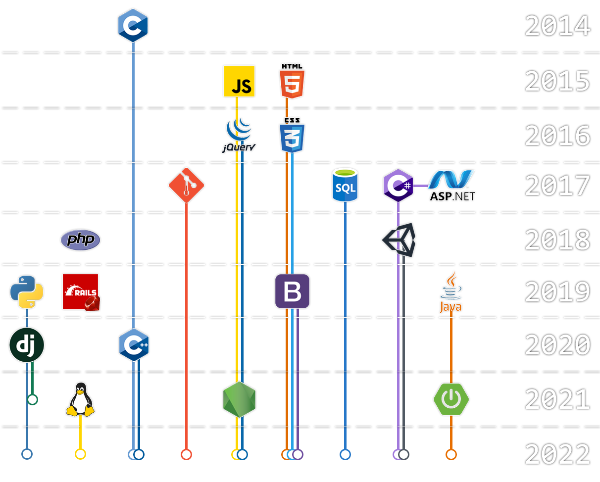

```cs
using System;
using System.Collections.Generic;
```


```cs
class Lluckymou : Person
{
    public static string Name
    {
        get => "Lucas Nascimento";
    }

    public static string Email
    {
        get => "llucmou@gmail.com";
    }

    static Dictionary<string, string[]> experiences = new Dictionary<string, string[]>()
    {
        {"FrontEnd" , new string[] {"JS", "jQuery", "CSS", "Boostrap"}},
        {"BackEnd" , new string[] {"Ruby on Rails", "JS (Node.js)", "Java (Spring boot)", "Python (Django)"}},
        {"Tools" , new string[] {"Unity", "Linux", "Git", "Photoshop", "VSCode", "Heroku"}},
    };

    public static override string[] Experience(string type) => experiences[type];
```

## Experience
### `Unity` developer


I've been working as the lead developer of [sBotics](https://github.com/sBotics), a [Rescue Line](https://junior.robocup.org/rcj-rescue-line/) educational robotics simulator used by the [Brazilian Robotics Olympiad](http://www.obr.org.br) and [RoboCupJr Worldwide 2021](https://2021.robocup.org), boasting thousands of users worldwide.
```cs
    public static DateTime StartDate
    {
        get => new DateTime(2018, 02, 01);
    }

    public static DateTime EndDate
    {
        get => DateTime.Today;
    }
```

---

### `Ruby on Rails` *full-stack* developer


I worked for over a year at a local company serving start-ups and other small businesses with websites and web systems using *jQuery*, *Bootstrap*, *MongoDB*, *Git*, and obviously vanilla *JS* and *CSS*. 
```cs
    /*
     * def start_date
     *   return Date.new(2019, 02, 01)
     * end
     *
     * def end_date
     *   return Date.new(2020, 05, 15)
     * end
     */
```

---

### `Timeline` of skills

<p align="center">
  
</p>

```cs
    public static string Description
    {
        get =>
        @"
            Tech-enthusiast, geography nerd, passionate
            self-paced learner with knowledge in Web and
            Game development.

            Languages: English (C2) and Portuguese (native).
        ";
    }
```

---

```cs
}
```

Want to *use* this *'class'*? Contact-me on [Email](mailto:llucmou@gmail.com) or [LinkedIn](https://www.linkedin.com/in/lucas-moura-do-nascimento/).